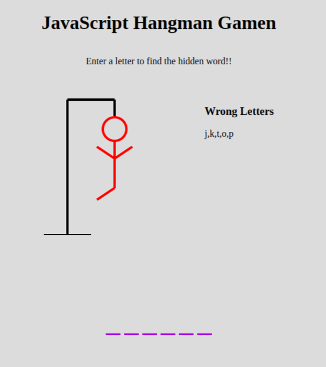

# A Simple Hangman game

# How-to:

This is a simple hangman game written in Javascript. To play, guess a letter by typing your guess on your keyboard. If you guess wrong 6 times, you lose. If you guess the word before your man turns red, you WIN!! You can also see the list of letters you entered incorrectly during the game.

Have fun!!

- [Hangman game](https://sbrycbc.github.io/Hangman-Game/)

